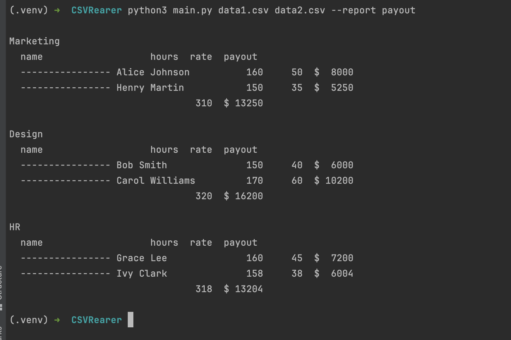
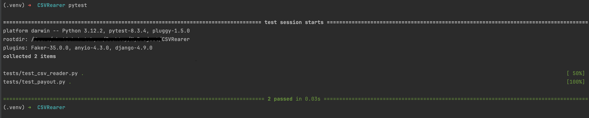

# 📊 CSVReader – Отчёт по зарплатам сотрудников

Скрипт читает CSV-файлы с данными сотрудников и формирует отчёт по выплатам (`payout`), сгруппированный по отделам. Архитектура проекта позволяет легко добавлять новые типы отчётов в будущем.

---

## 🚀 Пример запуска

```bash
python3 main.py data1.csv data2.csv --report payout
```


🧪 Тестирование
```bash
pip install -r requirements.txt
```
```bash
pytest
```

